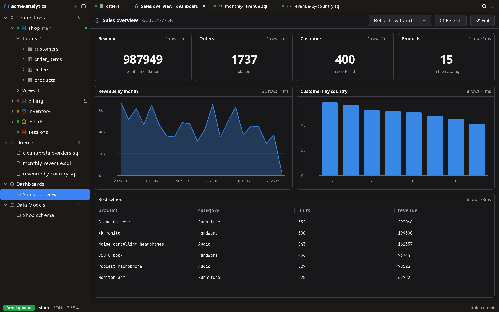
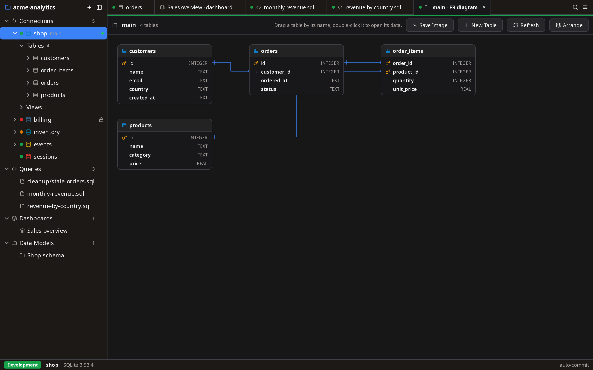

# DGopher

**Dig into your databases.**

A fast, native database client for **PostgreSQL, MySQL, ClickHouse, SQLite,
DuckDB and Redis**. It is a single Go binary, and its interface is drawn by
[MyGo](https://mygo.egoist.dev)'s native UI, with no webview, no JVM and no
Electron. It opens instantly, looks the same on Linux, macOS and Windows,
and is careful by default with the databases that matter.


## Footprint

Measured on Linux (amd64, Wayland) with version 0.1.0:

| | |
| --- | --- |
| Download | 36 MB, as the `.deb` or the `.tar.gz` |
| Executable | 99 MB, every driver and DuckDB compiled in |
| Memory at start | 164 MB resident, of which 36 MB is the app's own; the rest is the executable and the GTK and graphics libraries, mapped from disk |

## Features

- **Safe with production:**
  - Each connection has an environment, whose colour is shown everywhere.
  - On production, writes ask first, destructive statements need the
    connection's name typed, and manual commit is the default.
  - Read-only connections are enforced in the app and on the server.
  - An open transaction is never closed silently, and one left idle rolls
    back.
  - Grid edits are reviewed as SQL and applied in one transaction, one row
    per statement by primary key.
- **Secure:** passwords stay in the system keychain, an environment
  variable or a command such as a password manager, or are asked every
  time. Project files hold none, and secrets are redacted from history and
  logs.
- **Audit log:** every statement, edit, import, export and confirmation is
  recorded per project in a tamper-evident hash chain. You can verify it
  and export it.
- **Admin:** server activity with running queries to cancel, locks and the
  slowest statements; users and privileges; and VACUUM, ANALYZE, REINDEX
  or OPTIMIZE from a table's menu.
- **Query plans:** Explain and Explain Analyze as a tree of steps or a
  flame graph, with rows estimated and found, and advice on what makes a
  query slow: a full scan to keep few rows, a sort spilling to disk, a
  nested loop rescanning a table.
- **Every way in:**
  - PostgreSQL, MySQL, ClickHouse (native or HTTP), SQLite and DuckDB
    files, and Redis: one server, a cluster, or through Sentinel.
  - Drop a CSV, Parquet or JSON file on the window to query it in place
    with DuckDB.
  - TLS with a custom CA and client certificates, SSH tunnels through jump
    hosts with host keys checked, and SOCKS5 or HTTP proxies.
  - Log in without a password through AWS IAM, Google Cloud IAM or
    Microsoft Entra ID, or Kerberos on PostgreSQL.
- **Data:** copy tables between databases and engines, compare rows,
  generate test data, import CSV, JSON, Parquet, Excel and XML, back up and
  restore.
- **Schema:** ER diagrams you edit, a table designer, data models that
  generate migrations, a query builder, and search across objects and
  definitions.
- **SQL editor:** highlighting, completion from the catalog, a ▶ on every
  statement, `:name` parameters, folding, multiple cursors, Vim keys, find
  and replace, Go to Definition, problems underlined as you type, and a
  session per editor.
- **Results grid:** streams large results, filters (in SQL or with a
  builder), sorts, edits rows inline, follows foreign keys to the rows they
  point at and from the rows that point back, profiles every column, and
  exports to CSV, JSON, SQL, Parquet, Excel and more. Values open in
  JSON, XML, hex and image viewers.
- **Git-friendly projects:** connections, query files, snippets,
  dashboards and data models live in your repository, without secrets.
- **Dashboards and charts:** any result as a bar, line, area, scatter, pie
  or histogram chart, and any statement as a dashboard panel, a number, a
  chart or a table, with parameters and refresh.
- **Redis:** a key browser, value editors for every type and module, and a
  console.
- **Keyboard first:** a command palette, quick open for tables and query
  files, query history and snippets, and every shortcut customizable.
- **One native binary:** every driver compiled in, and nothing to install
  beside it.
- **Your way:** light, dark and custom themes, more windows and tabs side
  by side, and every control named for screen readers.

See [Features](docs/features.md) for the full list, and the
[Safety model](docs/safety.md) and [Audit log](docs/audit-log.md) for the
details.

| | |
| --- | --- |
|  |  |

## Install

Download the build for your system from the
[latest release](https://github.com/saanuregh/dgopher/releases/latest):
Linux (amd64, arm64), macOS (Apple silicon, Intel) and Windows (amd64).
The builds are not signed yet: macOS asks you to allow the app once, in
System Settings, Privacy & Security, and Windows SmartScreen warns once.

To build it yourself you need Go and a C compiler; see
[Development](docs/development.md).

```sh
CGO_ENABLED=1 go run .
```

New here? **Try the sample** on the start page opens a small shop database
in SQLite, and the tour shows the window's parts in a minute.

## Documentation

- [Features](docs/features.md)
- [Safety model](docs/safety.md)
- [How SQL is read](docs/sql.md)
- [Audit log](docs/audit-log.md)
- [Where things are kept](docs/storage.md)
- [Development](docs/development.md)
- [Roadmap and known limitations](docs/roadmap.md)

## License

Copyright 2026 DGopher contributors. Licensed under the
[Apache License, Version 2.0](LICENSE).

The icon is based on the Go gopher, designed by Renée French and licensed
under [CC BY 4.0](https://creativecommons.org/licenses/by/4.0/).
